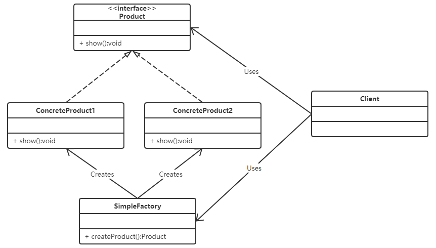

# 简单工厂

### 说明

> 简单工厂不在 GoF 23 种设计模式之列

### 概述

- 在简单工厂模式中创建实例的方法通常为静态（static）方法，
  因此简单工厂模式（Simple Factory Pattern）又叫作静态工厂方法模式
  （Static Factory Method Pattern）
    
### 缺陷

- 简单工厂模式每增加一个产品就要增加一个具体产品类和一个对应的具体工厂类，
  这增加了系统的复杂度，违背了“开闭原则

> “工厂方法模式”是对简单工厂模式的进一步抽象化，
> 其好处是可以使系统在不修改原来代码的情况下引进新的产品，
> 即满足开闭原则。

### 类图

